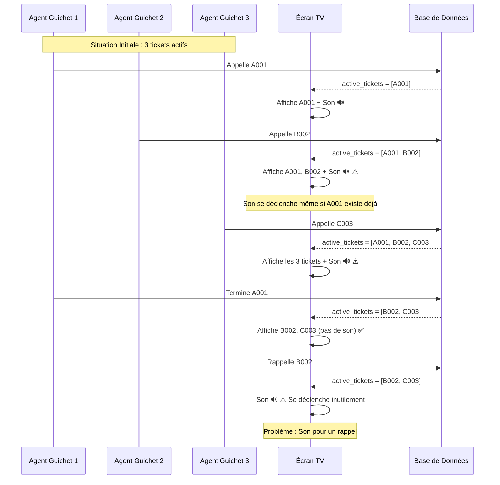

# Plan d'Analyse : Synchronisation Multi-Guichets / TV

## 🎯 Objectif
Vérifier qu'il n'y a pas de confusion entre les actions des agents (terminer/absent/rappeler) et l'affichage sur la TV quand plusieurs guichets sont occupés simultanément.

---

## 🔍 Scénarios à Analyser

### Scénario 1 : Action d'un Guichet n'affecte PAS les autres ✅

**Situation** : 3 guichets occupés (A001→G1, B002→G2, C003→G3)

**Action** : Agent Guichet 1 termine son ticket A001

**Comportement Attendu** :
- ✅ Guichet 1 : `currentTicket = null` (écran vide)
- ✅ Guichet 2 : B002 reste actif, pas affecté
- ✅ Guichet 3 : C003 reste actif, pas affecté
- ✅ TV : Affiche seulement B002 et C003 (A001 disparaît)
- ✅ TV : Pas de son/flash (ce n'est pas un nouvel appel)

**Code à vérifier** :
```php
// app/Http/Controllers/QmsController.php - completeTicket()
// Doit modifier UNIQUEMENT le ticket spécifique
$ticket->update(['statut' => Ticket::STATUT_TERMINÉ]);
// ✅ Bon : N'affecte que ce ticket
```

---

### Scénario 2 : Nettoyage Automatique lors d'un Nouvel Appel ⚠️

**Situation** : Guichet 1 a un ticket A001 actif, mais l'agent n'a pas terminé

**Action** : Agent Guichet 1 appelle un nouveau ticket (A002)

**Comportement Actuel** :
```php
// Ligne 171-173 : Nettoyage automatique
Ticket::where('guichet_id', $request->guichet_id)
      ->where('statut', Ticket::STATUT_APPELÉ)
      ->update(['statut' => Ticket::STATUT_TERMINÉ]);
```

**Analyse** :
- ✅ **Bon** : Nettoie uniquement les tickets de CE guichet
- ✅ **Bon** : N'affecte PAS les autres guichets
- ✅ **Bon** : Évite les "tickets zombies"

**Problème Potentiel** : Aucun, c'est le comportement attendu.

---

### Scénario 3 : Son/Flash se déclenchent pour TOUS les appels ⚠️

**Situation** : B002 est actif sur Guichet 2, C003 sur Guichet 3

**Action** : Agent Guichet 1 appelle A001

**Comportement Actuel** :
```javascript
// display.blade.php ligne 300-304
if (this.currentTicket && 
    (this.currentTicket.id !== this.lastTicketId)) {
    this.lastTicketId = this.currentTicket.id;
    this.triggerFlash(); // ← Son + Flash
}
```

**Problème Identifié** :
- ⚠️ Le son se déclenche même si B002 et C003 sont toujours actifs
- ⚠️ Les clients avec B002 et C003 entendent un son, mais ce n'est pas pour eux
- ⚠️ Peut créer de la confusion

**Solution Proposée** :
- Vérifier si c'est un NOUVEAU ticket (pas juste un changement de `last_called`)
- Ou : Ne jouer le son que si le ticket est appelé depuis moins de 2 secondes

---

### Scénario 4 : Terminer un Ticket n'affecte que ce Guichet ✅

**Situation** : 3 guichets occupés

**Action** : Agent Guichet 2 termine B002

**Comportement** :
- ✅ Backend : Met seulement B002 à "terminé"
- ✅ TV : Rafraîchit et affiche seulement A001 et C003
- ✅ Pas de son (ce n'est pas un appel)
- ✅ Guichet 2 voit son écran vide

**Code** :
```php
// completeTicket() - Ligne 207-214
public function completeTicket(Ticket $ticket)
{
    $ticket->update(['statut' => Ticket::STATUT_TERMINÉ]);
    // ✅ Bon : Modifie uniquement ce ticket
}
```

---

### Scénario 5 : Marquer "Absent" n'affecte que ce Guichet ✅

**Situation** : 3 guichets occupés

**Action** : Agent Guichet 3 marque C003 comme absent

**Comportement** :
- ✅ Backend : Met seulement C003 à "absent"
- ✅ TV : Rafraîchit et affiche seulement A001 et B002
- ✅ C003 apparaît dans l'historique avec badge rouge "Absent"
- ✅ Pas de son

**Code** :
```php
// cancelTicket() - Ligne 220-228
$ticket->update(['statut' => Ticket::STATUT_ABSENT]);
// ✅ Bon : N'affecte que ce ticket
```

---

### Scénario 6 : Rappeler un Ticket ⚠️

**Situation** : Guichet 1 a marqué A001 comme absent, Guichet 2 et 3 ont des tickets actifs

**Action** : Agent Guichet 1 rappelle A001

**Comportement** :
```php
// recallTicket() - Ligne 233-248
$ticket->update([
    'statut' => Ticket::STATUT_APPELÉ,
    'called_at' => now(), // ← Met à jour l'heure
]);
```

**Analyse** :
- ✅ A001 réapparaît sur la TV avec les autres tickets actifs
- ⚠️ **PROBLÈME** : `called_at` est mis à jour, donc A001 devient le `last_called`
- ⚠️ **PROBLÈME** : Son/Flash se déclenchent sur la TV
- ⚠️ **PROBLÈME** : Les clients avec B002 et C003 entendent un son alors que ce n'est pas pour eux

**Solution Nécessaire** :
- Ne pas mettre à jour `called_at` lors d'un rappel
- Ou : Détecter que c'est un rappel (pas un nouvel appel)
- Ou : Vérifier si le ticket était déjà appelé récemment

---

## 🔧 Problèmes Identifiés

### Problème 1 : Son se déclenche pour tous les appels ❌

**Description** :
Quand un agent appelle un ticket alors que d'autres guichets ont déjà des tickets actifs, le son se déclenche sur toute la TV. Les clients avec d'autres tickets actifs entendent un son alors que ce n'est pas pour eux.

**Impact** : Confusion pour les clients, ils peuvent penser que c'est leur tour alors que ce n'est pas le cas.

**Solution Proposée** :
1. Vérifier si le ticket est vraiment NOUVEAU (créé il y a moins de 5 secondes)
2. Ou : Ne jouer le son que si le ticket est dans `active_tickets` ET qu'il vient d'être appelé
3. Ou : Détecter les rappels différemment

---

### Problème 2 : Rappeler déclenche Son/Flash ⚠️

**Description** :
Quand un agent rappelle un ticket marqué absent, le son et le flash se déclenchent sur la TV car `called_at` est mis à jour et le ticket devient le `last_called`.

**Impact** : Confusion car le son se déclenche pour un ticket qui était déjà actif.

**Solution Proposée** :
- Ne pas mettre à jour `called_at` lors d'un rappel, utiliser l'heure d'origine
- Ou : Ajouter un flag pour différencier les rappels des nouveaux appels

---

## ✅ Points Positifs (Pas de Confusion)

1. **Nettoyage automatique** : N'affecte que le guichet concerné ✅
2. **Terminer un ticket** : N'affecte que ce ticket ✅
3. **Marquer absent** : N'affecte que ce ticket ✅
4. **Interface agent** : Chaque agent voit seulement son ticket ✅
5. **Affichage TV** : Affiche correctement tous les tickets actifs ✅

---

## 🎯 Plan d'Action

### Étape 1 : Corriger le Son pour les Rappels

**Fichier** : `app/Http/Controllers/QmsController.php`

**Modification** :
- Dans `recallTicket()`, ne pas mettre à jour `called_at` si le ticket était déjà appelé
- Ou : Ajouter un paramètre pour indiquer si c'est un rappel

### Étape 2 : Améliorer la Détection de Nouveaux Appels

**Fichier** : `resources/views/qms/display.blade.php`

**Modification** :
- Vérifier si le ticket est vraiment nouveau (créé récemment)
- Comparer `created_at` avec `called_at` pour détecter les vrais nouveaux appels
- Ne jouer le son que pour les vrais nouveaux appels

### Étape 3 : Test de Synchronisation

**Tests à effectuer** :
1. ✅ 3 agents appellent simultanément → Vérifier que les 3 tickets apparaissent
2. ✅ Un agent termine son ticket → Vérifier que les autres restent visibles
3. ✅ Un agent marque absent → Vérifier que les autres ne sont pas affectés
4. ✅ Un agent rappelle → Vérifier que le son ne se déclenche pas pour les autres clients
5. ✅ Un agent appelle un nouveau ticket → Vérifier que le son se déclenche uniquement pour ce ticket

---

## 📊 Diagramme de Synchronisation



---

## 🎯 Résumé

**Problèmes Majeurs** :
1. ❌ Son se déclenche pour tous les appels, même si d'autres tickets sont actifs
2. ⚠️ Rappeler déclenche son/flash inutilement

**Points Positifs** :
- ✅ Les actions d'un guichet n'affectent pas les autres
- ✅ L'affichage est correct (tous les tickets actifs visibles)
- ✅ Pas de confusion dans l'interface agent

**Actions Nécessaires** :
1. Améliorer la logique de détection des nouveaux appels
2. Différencier les rappels des nouveaux appels pour le son


