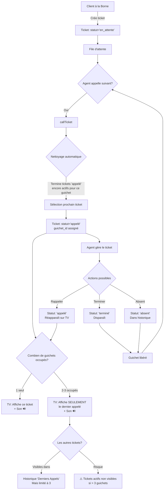

# Workflow : Gestion des Tickets QMS par les Agents

## Analyse du Système Actuel

### Architecture du Système

```
┌─────────────┐     ┌──────────────┐     ┌─────────────┐
│   KIOSK     │────▶│   TICKET     │────▶│   AGENT     │
│  (Borne)    │     │  (File att.) │     │  (Guichet)  │
└─────────────┘     └──────────────┘     └─────────────┘
                              │
                              ▼
                    ┌──────────────┐
                    │  ÉCRAN TV    │
                    │  (Affichage) │
                    └──────────────┘
```

---

## Workflow Détaillé : Cycle de Vie d'un Ticket

### Phase 1 : Création du Ticket

```
┌─────────────────────────────────────────────────────────┐
│  1. CLIENT À LA BORNE (Kiosk)                           │
├─────────────────────────────────────────────────────────┤
│  • Sélectionne un service                               │
│  • Optionnel : Vérifie son RDV                          │
│  • Reçoit un ticket (ex: A001)                          │
│  • Statut initial : "en_attente"                        │
└─────────────────────────────────────────────────────────┘
                            │
                            ▼
┌─────────────────────────────────────────────────────────┐
│  2. TICKET CRÉÉ                                         │
├─────────────────────────────────────────────────────────┤
│  • Numéro : Format [Lettre Service][001-999]           │
│  • Priorité calculée selon mode QMS du centre          │
│  • Ajouté à la file d'attente                           │
│  • Visible dans l'interface Agent                       │
└─────────────────────────────────────────────────────────┘
```

### Phase 2 : Appel du Ticket par l'Agent

```
┌─────────────────────────────────────────────────────────┐
│  3. AGENT APPEL LE SUIVANT                              │
├─────────────────────────────────────────────────────────┤
│  Interface Agent (/qms/agent)                           │
│  • Sélectionne son guichet                              │
│  • Clique sur "Appeler le suivant"                      │
│  • Système sélectionne le ticket selon :                │
│    - Priorité (RDV > Standard)                          │
│    - Date de création (FIFO)                            │
└─────────────────────────────────────────────────────────┘
                            │
                            ▼
┌─────────────────────────────────────────────────────────┐
│  4. TRAITEMENT BACKEND                                  │
├─────────────────────────────────────────────────────────┤
│  callTicket() dans QmsController :                      │
│  ✓ Nettoyage : Termine automatiquement les tickets      │
│    "appelé" encore actifs pour ce guichet               │
│  ✓ Recalcule les priorités de tous les tickets         │
│  ✓ Sélectionne le prochain ticket                       │
│  ✓ Met à jour : statut = "appelé"                       │
│                called_at = maintenant                    │
│                guichet_id = ID du guichet                │
└─────────────────────────────────────────────────────────┘
                            │
                            ▼
┌─────────────────────────────────────────────────────────┐
│  5. AFFICHAGE SUR L'ÉCRAN TV                            │
├─────────────────────────────────────────────────────────┤
│  • Son de notification joué                             │
│  • Flash visuel (effet ring jaune)                      │
│  • Affiche : Numéro du ticket                           │
│  • Affiche : Guichet de destination                     │
│  • Ajouté à l'historique "Derniers Appels"              │
└─────────────────────────────────────────────────────────┘
```

### Phase 3 : Gestion du Ticket par l'Agent

```
┌─────────────────────────────────────────────────────────┐
│  6. ACTIONS DISPONIBLES POUR L'AGENT                    │
├─────────────────────────────────────────────────────────┤
│                                                          │
│  ┌──────────────┐  ┌──────────────┐  ┌──────────────┐ │
│  │   RAPPELER   │  │   TERMINER   │  │    ABSENT    │ │
│  │   (Yellow)   │  │   (Green)    │  │   (Red)      │ │
│  └──────────────┘  └──────────────┘  └──────────────┘ │
│         │                 │                  │          │
│         │                 │                  │          │
│         ▼                 ▼                  ▼          │
│  Statut: "appelé"  Statut: "terminé"  Statut: "absent" │
│  called_at mis     completed_at =     completed_at =    │
│  à jour            maintenant          maintenant       │
│  Réapparaît sur    Disparaît de la    Apparaît dans    │
│  la TV             TV                  l'historique     │
│                                                          │
└─────────────────────────────────────────────────────────┘
```

---

## 🚨 PROBLÈME IDENTIFIÉ : Cas des 3 Guichets Occupés

### Scénario Problématique

```
Moment T0 : Aucun guichet occupé
┌──────────┐  ┌──────────┐  ┌──────────┐
│ Guichet 1│  │ Guichet 2│  │ Guichet 3│
│   Libre  │  │   Libre  │  │   Libre  │
└──────────┘  └──────────┘  └──────────┘

Moment T1 : Agent 1 appelle ticket A001
┌──────────┐  ┌──────────┐  ┌──────────┐
│ Guichet 1│  │ Guichet 2│  │ Guichet 3│
│  A001 ✅ │  │   Libre  │  │   Libre  │
└──────────┘  └──────────┘  └──────────┘
         │
         ▼
    ÉCRAN TV : Affiche "A001 → Guichet 1" 🔊

Moment T2 : Agent 2 appelle ticket B002
┌──────────┐  ┌──────────┐  ┌──────────┐
│ Guichet 1│  │ Guichet 2│  │ Guichet 3│
│  A001 ✅ │  │  B002 ✅ │  │   Libre  │
└──────────┘  └──────────┘  └──────────┘
         │            │
         └────────────┘
                ▼
    ÉCRAN TV : Affiche "B002 → Guichet 2" 🔊
    (A001 disparaît de la zone principale)
    (A001 peut apparaître dans l'historique)

Moment T3 : Agent 3 appelle ticket C003
┌──────────┐  ┌──────────┐  ┌──────────┐
│ Guichet 1│  │ Guichet 2│  │ Guichet 3│
│  A001 ✅ │  │  B002 ✅ │  │  C003 ✅ │
└──────────┘  └──────────┘  └──────────┘
         │            │            │
         └────────────┴────────────┘
                    ▼
    ÉCRAN TV : Affiche "C003 → Guichet 3" 🔊
    (A001 et B002 disparaissent de la zone principale)
    (Peuvent apparaître dans l'historique mais pas tous)

⚠️ PROBLÈME : 
   - Les clients avec A001 et B002 ne voient plus leur numéro
   - Ils doivent regarder l'historique (pas très visible)
   - Risque de confusion et de mécontentement
```

### Analyse Technique du Code

**Dans `QmsController::getQueueData()` :**
```php
// Ligne 344-350 : Récupère UN SEUL ticket (le dernier appelé)
$lastCalled = Ticket::select(...)
    ->appelé()
    ->orderBy('called_at', 'desc')  // ← Ordonne par date d'appel
    ->first();                       // ← Prend SEULEMENT le premier

// Ligne 374-379 : Récupère TOUS les tickets actifs
$activeTickets = Ticket::select(...)
    ->where('statut', 'appelé')
    ->get();  // ← Récupère TOUS, mais la TV ne l'utilise pas
```

**Dans `display.blade.php` :**
```javascript
// Ligne 246 : Utilise uniquement last_called
this.currentTicket = data.last_called;  // ← Un seul ticket affiché

// L'historique peut contenir d'autres tickets actifs, 
// mais seulement s'ils sont dans les 3 derniers
```

---

## 📊 Diagramme de Flux Complet



---

## 🔍 Points Critiques Identifiés

### 1. **Affichage TV Limité**
- ❌ N'affiche que le **dernier ticket appelé** (`last_called`)
- ❌ Si 3 guichets sont occupés, 2 clients ne voient pas leur numéro clairement
- ✅ Les tickets actifs peuvent apparaître dans l'historique, mais c'est limité à 3

### 2. **Gestion Multi-Guichets**
- ✅ Le système **permet** plusieurs tickets "appelé" simultanément
- ✅ Chaque guichet peut avoir son propre ticket actif
- ❌ La TV ne montre pas tous les tickets actifs en même temps

### 3. **Historique**
- ✅ Affiche les 3 derniers tickets (excluant `last_called`)
- ❌ Si 3 guichets sont occupés, certains tickets actifs peuvent ne pas apparaître

---

## 💡 Recommandations d'Amélioration

### Option 1 : Affichage Multi-Tickets sur la TV
```
Modifier display.blade.php pour afficher TOUS les tickets actifs
au lieu d'un seul.

Zone principale : Liste de tous les tickets "appelé" actuellement
Format : 
  ┌─────────────────────────┐
  │  A001 → Guichet 1       │
  │  B002 → Guichet 2       │
  │  C003 → Guichet 3       │
  └─────────────────────────┘
```

### Option 2 : Rotation Automatique
```
Afficher chaque ticket actif pendant X secondes, 
puis passer au suivant.

Exemple : 
  - Affiche A001 pendant 5 secondes
  - Affiche B002 pendant 5 secondes
  - Affiche C003 pendant 5 secondes
  - Retour à A001...
```

### Option 3 : Zone Dédiée Multi-Guichets
```
Ajouter une section "Guichets Actifs" sur la TV
affichant simultanément tous les tickets en cours.
```

---

## 📋 Résumé du Workflow

1. **Création** : Client prend ticket → statut "en_attente"
2. **Appel** : Agent appelle → statut "appelé" + guichet assigné
3. **Affichage TV** : Affiche le **dernier appelé** uniquement
4. **Gestion** : Agent peut rappeler, terminer, ou marquer absent
5. **Problème** : Si plusieurs guichets occupés, seuls les plus récents sont visibles

---

## 🎯 Conclusion

Le système fonctionne correctement pour **1-2 guichets**, mais présente une **limitation d'affichage** quand **3 guichets sont occupés simultanément**. Les clients peuvent ne pas voir leur numéro clairement s'ils ne regardent pas l'historique.

**Action recommandée** : Implémenter l'Option 1 ou 2 pour améliorer l'expérience utilisateur.


